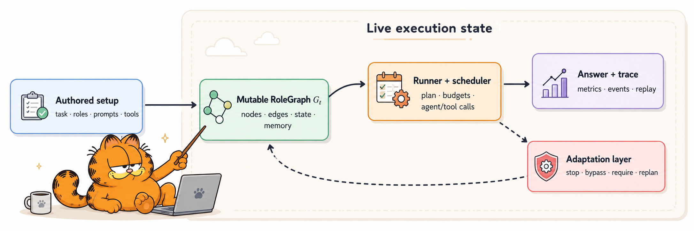

# gMAS

**Build multi-agent systems whose roles and connections can change while they run.**

[](https://github.com/frontier-ai-next/gMAS/actions/workflows/ci.yml)
[](https://frontier-ai-next.github.io/gMAS/)
[](https://github.com/frontier-ai-next/gMAS/releases)
[](https://www.python.org/)
[](LICENSE)

[Documentation](https://frontier-ai-next.github.io/gMAS/) ·
[Quick start](https://frontier-ai-next.github.io/gMAS/getting-started/quickstart/) ·
[API reference](https://frontier-ai-next.github.io/gMAS/api/core/) ·
[Benchmarks](https://frontier-ai-next.github.io/gMAS/benchmarks/) ·
[Releases](https://github.com/frontier-ai-next/gMAS/releases)

gMAS is an open-source Python framework for building and running graph-based
multi-agent systems with LLMs. Nodes hold roles and tasks; edges carry work and
context; the runner schedules model and tool calls. Budgets, memory, events, and
changes to the remaining plan stay visible in the same execution model.



> **Project status:** gMAS is an early release for developers and researchers.
> The public API is tested on Python 3.12 and 3.13. Pin a version for production
> experiments and expect some advanced APIs to evolve.

## What stays explicit

Agent workflows quickly accumulate dependencies, parallel branches, tool
permissions, budgets, and failure paths. gMAS keeps them in the graph and
runner configuration instead of spreading them across prompt templates and
callbacks:

- the team is stored in `RoleGraph`;
- the scheduler derives execution order and parallel groups from the graph;
- each role can have its own instructions, model, tools, and local state;
- the runner records outputs, token use, latency, errors, and topology changes;
- typed policies can stop, skip, reroute, or recover work during the same run;
- the graph can be exported for routing, pruning, and graph analysis.

## Core capabilities

| Area | What gMAS provides |
| --- | --- |
| Graph model | Agents, task nodes, weighted communication edges, conditions, execution boundaries, node state, and graph features |
| Execution | Synchronous, asynchronous, streaming, sequential, and graph-derived parallel execution |
| Runtime control | Early stop, skip/force, conditional routing, edge edits, recovery chains, plan rebuilds, and final-responder changes |
| Models | A simple callable interface, OpenAI-compatible endpoints, and per-agent caller selection |
| Tools | Registry-based tools, custom function tools, shell, code, file search, web search, MCP, and optional computer-use integrations |
| Context | Per-agent state, hidden channels, working and long-term memory, and optional shared memory |
| Reliability | Timeouts, retries, fallbacks, error policies, token/time budgets, and loop limits |
| Observability | Typed lifecycle events, callbacks, streaming, metrics, JSONL traces, and complete execution results |
| Graph ML | Adjacency and edge tensors, embeddings, pruning hooks, GNN routing, and PyTorch Geometric export |

## Install

gMAS requires Python 3.12 or 3.13.

```bash
pip install frontier-ai-gmas
```

With `uv`:

```bash
uv add frontier-ai-gmas
```

Install only the integrations you need:

```bash
pip install "frontier-ai-gmas[web-search]"
pip install "frontier-ai-gmas[mcp]"
pip install "frontier-ai-gmas[embeddings,pyg]"
pip install "frontier-ai-gmas[viz]"
```

| Extra | Purpose |
| --- | --- |
| `web-search` / `web-fast` | Search and fast HTML extraction |
| `selenium` | Browser-backed web interaction |
| `mcp` | Model Context Protocol tools |
| `embeddings` | Sentence-transformer embeddings |
| `pyg` | PyTorch Geometric graph export and GNN workflows |
| `viz` | Graphviz and Matplotlib visualization |
| `computer-use-*` | Platform-specific screen and computer-use support |

See the [installation guide](docs/getting-started/installation.md) for the full
extras matrix and development setup.

## Quick start

The runner accepts any `Callable[[str], str]`. This keeps the graph independent
of a particular model vendor.

```python
import os

from openai import OpenAI

from gmas.builder import build_property_graph
from gmas.core import AgentProfile
from gmas.execution import MACPRunner


client = OpenAI(
    api_key=os.environ["LLM_API_KEY"],
    base_url=os.environ.get("LLM_BASE_URL"),
)


def call_llm(prompt: str) -> str:
    response = client.responses.create(
        model=os.environ["LLM_MODEL"],
        input=prompt,
    )
    return response.output_text


agents = [
    AgentProfile(
        agent_id="researcher",
        display_name="Researcher",
        description="Collect the relevant facts and assumptions.",
    ),
    AgentProfile(
        agent_id="reviewer",
        display_name="Reviewer",
        description="Check the evidence and identify weak claims.",
    ),
    AgentProfile(
        agent_id="writer",
        display_name="Writer",
        description="Produce the final concise answer.",
    ),
]

graph = build_property_graph(
    agents,
    workflow_edges=[
        ("researcher", "reviewer"),
        ("reviewer", "writer"),
    ],
    query="What would make this system safe to deploy?",
)

result = MACPRunner(llm_caller=call_llm).run_round(graph)

print(result.final_answer)
print(result.execution_order)
print(result.total_tokens, result.total_time)
```

`run_round` returns `MACPResult`, including the final answer, execution order,
messages, timing, and token totals. Tools, parallel branches, memory, per-agent
models, callbacks, budgets, and routing conditions can be added to the same
graph.

## The execution model

Execution has five stages:

1. **Authored setup** — define the task, roles, prompts, tools, and initial
   connections.
2. **Live role graph** — keep agents, edges, conditions, state, memory, and
   learned features in `RoleGraph`.
3. **Planning and scheduling** — derive the executable subgraph, dependency
   order, parallel groups, and final responder.
4. **Agent execution** — call models and tools under retry, timeout, loop, and
   budget policies.
5. **Adaptation and results** — update the remaining plan when allowed, then
   return the answer together with its trace and metrics.

`RoleGraph` remains available throughout the run; it is not discarded after
the initial plan is built.

## Runtime adaptation

Dynamic topology is opt-in. A topology hook observes a completed step and
returns a bounded `TopologyAction`; the runner validates and applies it to the
remaining plan.

```python
from gmas.execution import MACPRunner, RunnerConfig, StepContext, TopologyAction


def stop_after_approval(ctx: StepContext, graph) -> TopologyAction | None:
    if ctx.agent_id == "reviewer" and "APPROVED" in (ctx.response or ""):
        return TopologyAction(
            early_stop=True,
            early_stop_reason="The reviewer approved the current answer.",
        )
    return None


config = RunnerConfig(
    enable_dynamic_topology=True,
    topology_hooks=[stop_after_approval],
)

runner = MACPRunner(llm_caller=call_llm, config=config)
result = runner.run_round(graph)
```

Topology actions can:

- stop execution with a recorded reason;
- skip or force selected agents;
- add or remove communication edges;
- insert recovery work into the remaining plan;
- change the final responder;
- trigger a plan rebuild after graph changes.

See [Dynamic topology](docs/user-guide/advanced/dynamic-topology.md) for hooks,
early-stop conditions, conditional edges, and direct graph mutation.

## Execution modes

The runner exposes blocking, async, and event-streaming interfaces:

```python
from gmas.execution import StreamEventType

# Blocking
result = runner.run_round(graph)

# Async
result = await runner.arun_round(graph)

# Streaming
for event in runner.stream(graph):
    if event.event_type == StreamEventType.AGENT_OUTPUT:
        print(event.agent_id, event.content)

# Async streaming
async for event in runner.astream(graph):
    if event.event_type == StreamEventType.AGENT_OUTPUT:
        print(event.agent_id, event.content)
```

Streaming covers run and agent lifecycle events, token events, errors and
retries, parallel groups, memory access, budget warnings, topology changes,
pruning, fallbacks, and the final result.

Read [Running agents](docs/user-guide/execution/running.md),
[Streaming](docs/user-guide/execution/streaming.md), and
[Parallel execution](docs/user-guide/execution/parallel.md) for details.

## Models and tools

A caller factory can assign a different synchronous or asynchronous model
caller to each agent. Callers may use hosted APIs, OpenAI-compatible gateways,
or local models.

`ToolRegistry` owns the tools available to a run. Built-in and optional tools
cover shell execution, code interpretation, file search, web search and fetch,
browser actions, MCP, and computer use. Python functions can also be registered
as typed tools and converted to OpenAI-compatible schemas.

- [Multi-model support](docs/user-guide/advanced/multi-model.md)
- [Tools and custom tool registration](docs/user-guide/tools.md)
- [API reference: tools](docs/api/tools.md)

## Memory, budgets, and reliability

`RunnerConfig` holds execution policy outside agent prompts. It configures:

- per-run timeouts, retry count, delay, and exponential backoff;
- total token and time budgets;
- maximum tool and loop iterations;
- continue, retry, fallback, or raise behavior for failures;
- local working memory, long-term memory, and shared-memory access;
- hidden-state channels and embedding propagation;
- parallelism and routing policy.

Budget stops and recovery paths appear in the result and event stream.

See [Memory](docs/user-guide/memory.md),
[Error handling](docs/user-guide/advanced/error-handling.md), and the
[`MACPRunner` guide](docs/user-guide/core/macp-runner.md).

## Observability

`MACPResult` includes the final answer, final agent, execution order, per-agent
messages, step results, token and timing totals, errors, fallbacks, pruned
agents, budget information, hidden states, early-stop details, and the number
of topology modifications.

Lifecycle callbacks make the same information available while the run is in
progress. Built-in handlers support terminal output, metrics collection, and
file traces; custom sync and async handlers can integrate application logging,
telemetry, or UI updates.

See [Callbacks](docs/user-guide/callbacks.md) and
[Reproducibility](docs/benchmarks/reproducibility.md).

## Graph learning and research workflows

`RoleGraph` can expose the live multi-agent system as numerical graph data:

- adjacency and weighted-edge tensors;
- node and edge attributes;
- role embeddings and hidden states;
- PyTorch Geometric `Data` export;
- scheduler hooks for learned routing and pruning.

These interfaces support experiments that learn routing or prune a graph. They
are optional; ordinary graph execution does not require PyTorch Geometric.

Start with [GNN routing](docs/user-guide/advanced/gnn-routing.md) and the
[GNN example](docs/examples/gnn-routing.md).

## Benchmarks and reproducibility

Benchmark code is kept separate from product examples. Each evaluation track
has its own directory, entry point, input notes, and output contract under
[`benchmarks/`](benchmarks/README.md).

| Track | What it evaluates |
| --- | --- |
| Matched topology | gMAS and LangGraph under matched roles, prompts, models, and graph shapes |
| Runtime controls | Early stopping, disabled nodes, reachability, adaptation, hidden channels, and multi-model execution |
| GAIA | Tool-enabled question answering under a fixed tool budget |
| AgentPrune | Learned graph pruning on the MultiAgentBench research-idea track |
| Terminal-Bench | Single-agent and conditional-team terminal task harnesses |

Reported results, statistical tests, limitations, and reproduction notes live
together in the [benchmark documentation](docs/benchmarks/index.md). Comparative
numbers are intentionally kept out of the front page so that results are read
with their scope and caveats.

## Scope

gMAS fits workflows that need to:

- model a team with explicit dependencies and parallel branches;
- inspect or visualize how work moves between roles;
- change the remaining workflow based on intermediate results;
- enforce tool, token, time, or iteration budgets centrally;
- mix models or tool permissions across agents;
- collect reproducible traces and per-agent metrics;
- train or evaluate routing and graph-pruning policies.

A direct function chain is usually simpler for a fixed one-model pipeline. For
durable checkpointing and human-in-the-loop resume, review the trade-offs in
[gMAS and LangGraph](docs/comparisons/langgraph.md).

## Ecosystem

| Project | Role |
| --- | --- |
| **gMAS** | This repository: the Python graph engine, agents, runners, tools, memory, and evaluation harnesses |
| [flowMAS](https://github.com/frontier-ai-next/flowMAS) | Visual workflow studio, demo API, and self-hosted observability built on the gMAS SDK |

gMAS is a standalone framework. flowMAS is a separate downstream application
that consumes the SDK without changing the core library.

## Documentation

The complete documentation is published at
[frontier-ai-next.github.io/gMAS](https://frontier-ai-next.github.io/gMAS/).

| Goal | Start here |
| --- | --- |
| Install gMAS and its extras | [Installation](docs/getting-started/installation.md) |
| Build a first agent graph | [Quick start](docs/getting-started/quickstart.md) |
| Understand the data model | [Key concepts](docs/user-guide/key-concepts.md) |
| Configure the runner | [MACPRunner](docs/user-guide/core/macp-runner.md) |
| Add tools and callbacks | [Tools](docs/user-guide/tools.md) · [Callbacks](docs/user-guide/callbacks.md) |
| Change a graph during execution | [Dynamic topology](docs/user-guide/advanced/dynamic-topology.md) |
| Stream progress into an application | [Streaming](docs/user-guide/execution/streaming.md) |
| Reproduce reported results | [Benchmarks](docs/benchmarks/index.md) |
| Review framework trade-offs | [gMAS and LangGraph](docs/comparisons/langgraph.md) |
| Browse Python APIs | [API reference](docs/api/core.md) |

## Repository layout

```text
gmas/
├── .github/        # CI, Pages, releases, and contribution templates
├── src/gmas/       # library code
├── tests/          # unit and integration tests
├── examples/       # focused runnable examples
├── benchmarks/     # evaluation harnesses and data contracts
├── docs/           # guides, API reference, and reported results
└── pyproject.toml  # package metadata and optional dependencies
```

`examples/` contains small API demonstrations. `benchmarks/` contains evaluation
entry points and their run contracts; benchmark configuration is not part of
the public library API.

## Development

Install the development environment:

```bash
git clone https://github.com/frontier-ai-next/gmas.git
cd gmas
uv sync --all-extras --group test --group lint --group typecheck --group docs
```

Run the release checks:

```bash
uv run tox -e lint,quick
uv run --group docs mkdocs build --strict
```

The test matrix covers Python 3.12 and 3.13. Type checking is currently an
advisory check while known type debt is reduced.

See [CONTRIBUTING.md](CONTRIBUTING.md) for branch, style, test, and pull-request
guidance. Release maintainers should also review the
[release checklist](docs/contributing/releasing.md).

## Contributing

Open an issue for bugs, missing documentation, new adapters, or API proposals.
Discuss larger changes before implementation when they affect graph semantics
or public interfaces.

When contributing code:

1. keep changes focused and add tests for observable behavior;
2. preserve typed boundaries around graphs, runners, tools, and results;
3. update the relevant guide when a public API changes;
4. do not commit credentials, benchmark outputs, or provider-specific secrets;
5. use Conventional Commits so release tooling can calculate version changes.

## License

gMAS is released under the [MIT License](LICENSE).
